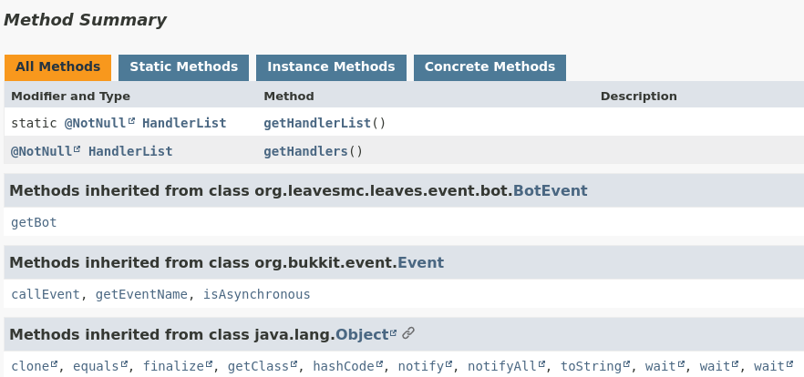

<!-- @format -->

# 高级教程

## skript-reflect

**skript-reflect** 是 **Skript** 的一个拓展插件，允许你运用Java的反射机制来进行更高级的操作，它旨在将 **Java** 的功能与 **Skript** 易于使用的开发环境相结合。

有了 **skript-reflect** 的 **Skript** 几乎可以完成插件能做的任何事，不过是复杂性的问题。

为什么需要 skript-reflect？

- 正确编写插件是很困难的，特别是如果你是 **Java** 的新手。 **skript-reflect** 将为您负重前行，让你专注于编写高质量的 **Skript** 脚本。

- 用 **skript-reflect** 编写的扩展可以快速测试，就像任何其他脚本一样。与需要编译和完全重新启动服务器的 **Skript** 插件不同， **skript-reflect** 脚本可以使用简单的 `sk reload`。

- 在 sk 脚本中实现某些功能可能需要使用反射来访问私有方法、字段和构造函数。 **skript-reflect** 的内置反射允许你无缝访问这些私有成员。

- **Skript** 的基本特性之一是其极大的可定制性。使用 **skript-reflect** 编写的扩展使 sk 的这点更为突出，这允许你在必要时快速更改您的代码。

下面的代码块包含了一些 **skript-reflect** 基础的语法。

其作用是在有玩家使用 **EssentialsX** 的 tpa 尝试`/tpa lilingfeng`时阻止这件事

```sk
import:
    net.ess3.api.events.TPARequestEvent   # 导入java类

# 监听事件
on TPARequestEvent:
    set {_ess_User} to event.getTarget()   # 获取User对象
    set {_player} to {_ess_IUser}.getBase()   # 获取Player对象
    # 判断玩家
    if {_player} is player("lilingfeng"):
        send "&clilingfeng是我的不准tpa到她那里🥵"
        cancel event   # 取消事件
```

下面来逐行解析

```sk
import:
    net.ess3.api.events.TPARequestEvent
```

这两行代码意为导入`net.ess3.api.events`包中的`TPARequestEvent`**类**。

`import:`块必须放在脚本的最左端，前面不能有缩进。

对类的调用必须在导入完成后进行，因此我们建议你尽可能将此语句放在脚本中靠顶端的位置。

通过`import:`块导入类后， **skript-reflect** 将创建一个 **Expressions** ，允许您通过其名称轻易地引用 Java 类。

```sk
on TPARequestEvent:
```

这行代码意为注册监听`TPARequestEvent`事件，与普通 sk 里注册事件的语法没啥区别。

```sk
    set {_ess_IUser} to event.getTarget()   # 获取IUser对象
    set {_player} to {_ess_IUser}.getBase()   # 获取Player对象
```

这行代码意为调用这个事件里的`getTarget()`方法，来获取 tpa 的目标，其返回一个`IUser`。

这个`IUser`是 EssentialsX 的一个**接口**，`User`类**实现**了它，可以在[essentialsx 的 javadoc](https://jd-v2.essentialsx.net/net/ess3/api/iuser)里查看。

```sk
    if {_player} is player("lilingfeng"):
        send "&cliliangfeng是我的不准tpa到她那里🥵"
        cancel event
```

这几行和普通的 sk 语法没什么区别，作用是判断然后取消事件。

### 使用方法

如果你需要调用其他的插件或是一些 **skript** 里没有而 [Bukkit API](https://bukkit.windit.net/javadoc/) 有的 API，那么会很棘手。

**skript-reflect** 很好的解决了这一点。

比如，你正在使用 **Leaves** 服务端，想要用sk来改变Leaves中假人在玩家列表中显示的名字，那么可以遵循以下步骤：

#### 查询 Javadoc

修改假人的名字这一行为应该在假人加入服务器时进行，所以我们得监听这一事件。

我们需要找到 bot 事件到底是哪个，查询[Leaves 的 Javadoc](https://repo.leavesmc.org/javadoc/snapshots/org/leavesmc/leaves/leaves-api/1.20.6-R0.1-SNAPSHOT)：


这里查询找到了`org.leavesmc.leaves.event.bot.BotEvent`事件。

看命名就知道应该会有更详细的**子类**来**继承**它，点进去看看，可以看到：


通过看类名可以知道，`BotJoinEvent`就是我们要的事件。

看介绍，发现这个事件会“Called when a fakeplayer joins a server”

接下来让我们看看这个类有哪些**方法**。



可以看到，最主要的是一个`getBot()`方法，在让我们看看这个方法会返回什么。

点击超链接，可以看到这个方法会返回一个`Bot`对象。

这个`Bot`接口是继承自`Player`的，也就是说，`Player`有的方法，`Bot`都有。

再次查询 [Bukkit API](https://bukkit.windit.net/javadoc/org/bukkit/entity/Player.html) 可以找到`Player`类有的方法，如`Player#setPlayerListName()`，这正是我们需要的方法。

#### 编写程序

开始编写程序

```sk
import:
    org.leavesmc.leaves.event.bot.BotJoinEvent   #导入类

# 监听事件
on BotJoinEvent:
    set {_bot} to event.getBot()   # 获取假人
    set {_bot_name} to {_bot}.getName()   # 储存假人原本的名字
    {_bot}.setPlayerListName("假的%{_bot_name}%")   # 修改假人在tab列表里的名字
```

这一过程也可适用于其他插件，比如[zimzaza4大蛇](https://github.com/zimzaza4)的 [Skript-Floodgate-Api](https://github.com/zimzaza4/Skript-Floodgate-Api) ，
就是利用 **skript-reflect** 来调用 [Floodagate API](https://wiki.geysermc.org/floodgate/api/) 的。

可以查看下面的教程来详细学习 **skript-reflect** 的基础功能（对，下面这一大坨只是基础）

### skript-reflect 基础教程

:::danger

此段部分或全部抄自 **skript-reflect** [官方文档](https://tpgamesnl.gitbook.io/skript-reflect/basics)

:::

#### 导入 Java 类

##### _在解析时导入类（推荐）_

在大多数情况下，无需运行脚本即可知道所需类的确切限定名称。如果是这种情况，您应该使用 **skript-reflect** 的`import`块：

:::info

为避免冲突，`import`块创建的表达式仅对导入它们的脚本可用。您必须在使用它们的每个脚本中导入 Java 类。

:::

```sk
import:
    java.lang.System

command /example:
    trigger:
        message "%System%" # java.lang.System
        System.out.println("test")
```

在大多数情况下，由`import`块创建的表达式不会相互冲突，也不会与其他 **Skript** 表达式冲突。如果这个类的名称与另一个表达式（如 `Player` 和 `String` ）冲突，则必须在别名下导入该类。

```sk
import:
    java.lang.String as JavaString

command /example:

```sk
on TPARequestEvent:
```

这行代码意为注册监听`TPARequestEvent`事件，与普通 sk 里注册事件的语法没啥区别。

```sk
    set {_ess_IUser} to event.getTarget()   # 获取IUser对象
    set {_player} to {_ess_IUser}.getBase()   # 获取Player对象
```

这行代码意为调用这个事件里的`getTarget()`方法，来获取 tpa 的目标，其返回一个`IUser`。

这个`IUser`是 EssentialsX 的一个**接口**，`User`类**实现**了它，可以在[essentialsx 的 javadoc](https://jd-v2.essentialsx.net/net/ess3/api/iuser)里查看。

```sk
    if {_player} is player("lilingfeng"):
        send "&cliliangfeng是我的不准tpa到她那里🥵"
        cancel event
```

这几行和普通的 sk 语法没什么区别，作用是判断然后取消事件。

