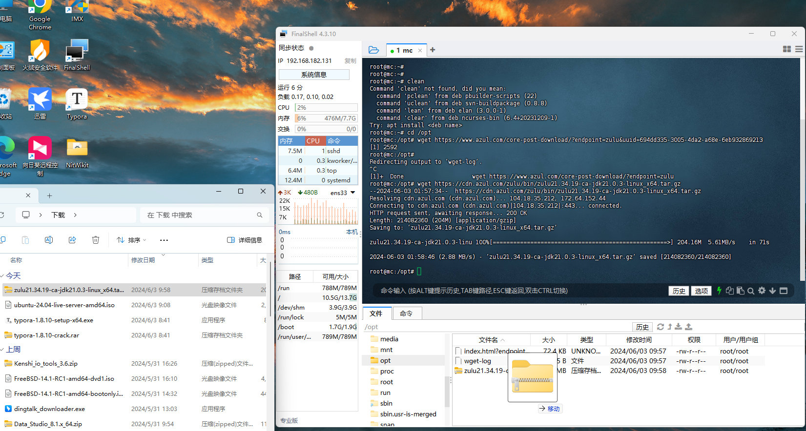

import Tabs from '@theme/Tabs';
import TabItem from '@theme/TabItem';

# 开服

开服之前，请检查服务器是否安装了 Java，在终端输入

`java -ver`

如果你看到类似以下的输出，那么服务器中已经安装了 Java

```
openjdk version "21.0.2" 2024-01-16 LTS
OpenJDK Runtime Environment Zulu21.32+17-CA (build 21.0.2+13-LTS)
OpenJDK 64-Bit Server VM Zulu21.32+17-CA (build 21.0.2+13-LTS, mixed mode, sharing)
```

## Java 安装

如果已经安装了 Java，可以忽略掉这一部分。如果环境未安装 Java 可以参考：

### 软件包管理器安装

下方以安装 `openjdk-17` 为例

<Tabs
  defaultValue="Debian/Ubuntu"
  values={[
    {label: 'Debian/Ubuntu', value: 'Debian/Ubuntu'},
    {label: 'RedHat/CentOS', value: 'RedHat/CentOS'},
    {label: 'ArchLinux', value: 'ArchLinux'},
  ]}>
  <TabItem value="Debian/Ubuntu">sudo apt install openjdk-17-jdk</TabItem>
  <TabItem value="RedHat/CentOS">sudo yum install java-11-openjdk</TabItem>
  <TabItem value="ArchLinux">sudo pacman -S jdk11-openjdk</TabItem>
</Tabs>

其他发行版安装方式自行百度

### 手动♂

推荐使用软件包管理器安装而不是自己手动装

<details>
    <summary>点击查看</summary>

一般来说，在 Linux 中进行软件安装部署会放在 `/opt` 目录下，我们也遵循这个规则，当然你也可以不遵循

使用cd切换到/opt目录

`cd /opt`

### 下载

#### SFTP 文件传输

不熟悉 wget 时，先使用 Windows 前往[zulu下载](https://www.azul.com/downloads/?package=jdk#zulu)，下载再使用 SFTP 软件上传到服务器 `/opt` 目录下。



#### wegt 下载

使用 wget 指令下载

`wget https://cdn.azul.com/zulu/bin/zulu21.34.19-ca-jdk21.0.3-linux_x64.tar.gz`


### 压缩包解压

解压压缩包：


将目录重命名为 jdk21 ：


这样就算是安装好了（PS：这里的操作仅适用于开服使用，若需要其他需要jdk的操作请使用包管理器安装openjdk）

</details>

## 多版本 Java 共存

方法很多，这里举出两种

## 方法一

<Tabs
  defaultValue="Debian/Ubuntu"
  values={[
    {label: 'Debian/Ubuntu', value: 'Debian/Ubuntu'},
    {label: 'RedHat/CentOS', value: 'RedHat/CentOS'},
    {label: 'ArchLinux', value: 'ArchLinux'},
  ]}>
  <TabItem value="Debian/Ubuntu">update-alternatives --config java</TabItem>
  <TabItem value="RedHat/CentOS">update-alternatives --config java</TabItem>
  <TabItem value="ArchLinux">archlinux-java set jdk-vesion</TabItem>
</Tabs>

然后选择你想使用的 Java ，接着 `java -version` 验证版本

## 方法二

设置别名

确定你所使用的终端，此处以 `bash`  和 `zulu Java` 为例

`vim ~/.bashrc` 在这个文件末尾追加

```
# java
alias java8='/usr/lib/jvm/zulu-8/bin/java'
alias java17='/usr/lib/jvm/zulu-17/bin/java'
```

然后刷新：`source ~/.bashrc`

- 使用 Java8 开服：

        java8 -jar example.jar

- 使用 Java17 开服：

        java17 -jar example.jar

## 开服

:::warning

TODO - 完善和排版

:::

在/opt目录中使用mkdir创建一个目录用于开服


将核心放入服务器内，并编写简单的开服脚本

使用 chmod 命令给脚本增加运行权限

```
chmod +x example.sh
```


输入./start.sh或者输入bash start.sh即可启动


使用vim修改eula为true就可以开服了


