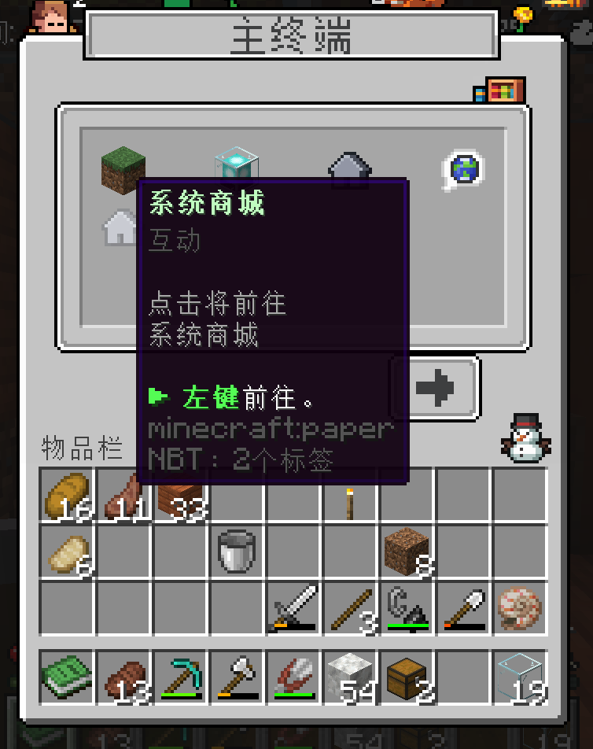
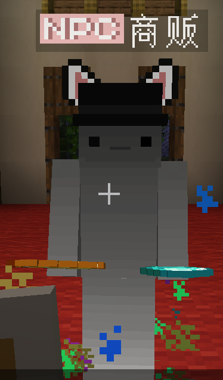

# 帮助：商店
> 缺少必备的材料，来 **商城** 看看吧。

## 找到商城
右键打开**服务器菜单**，左键**系统商城**图标[^1]。

[^1]:Monostar14：使用命令/shop可以马上打开商店界面GUI，不需要等待浪费时间了 😊

等待 5 秒传送至**主城**，右键 NPC “商贩“打开商店

## 注意
 商店物品购买**限量**，取决于当前服务器内物品储备量与玩家购买出售量

 

