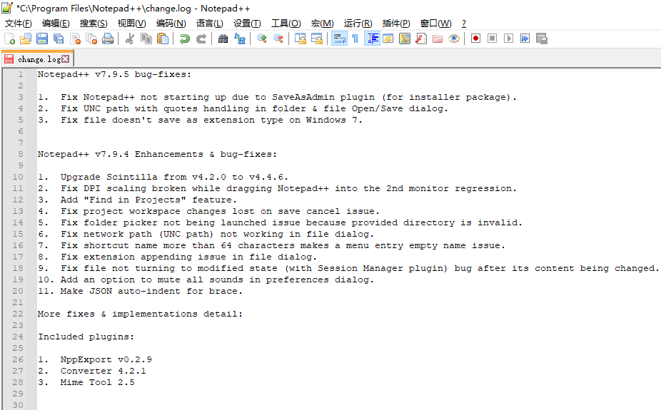
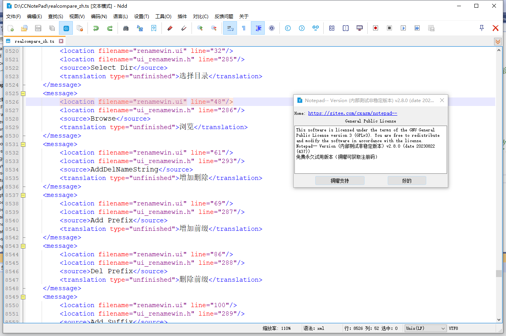
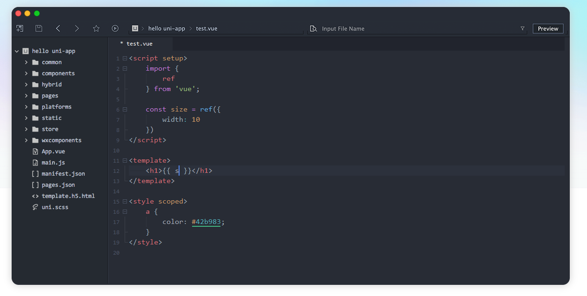

# 进入服务器

想要`更好的`游玩服务器你需要阅读下面的内容来进行相关的设置

## 客户端

最推荐的客户端版本为`1.20.4`
使用其他的版本**可能无法进入**服务器

你可以使用基于1.20.4的Fabric或者Forge整合包，但我们依旧推荐使用`Optifine`因为目前**只有**Optifine对材质包的兼容性最好

## 添加服务器

与其他服务器相同，你可以使用最原本的方法把IP输入地址后加入

IP地址`snowymc.top`

但是我们更推荐**将加载服务器材质包设置为启动**并且在语言中**设置Unicode字体为关**最后加入服务器

## 加入服务器

在进入服务器后会进行常规检查，在这期间请**不要移动**以防止检查出现错误

如果你是第一次进入服务器，你需要注册账号，在通过检查后您会被传送到

## Notepad3

  
点击展开

也是一个比较不错的文本编辑器

https://rizonesoft.com/downloads/notepad3/

https://github.com/rizonesoft/Notepad3

## Notepad++

  
点击展开

[notepad++](http://www.notepadplus.com.cn/)作者台独，多次辱H [这里](https://cn.bing.com/search?q=notepad%252B%252B%E8%BE%B1%E5%8D%8E)

个人建议更换，当然notepad++也不是不能用

## Notepad--

  
点击展开

国内作者维护的notepad++的替代品

[`Gitee`](https://gitee.com/cxasm/notepad--)
[`GitHub`](https://github.com/cxasm/notepad--)

## HbuilderX

  
点击展开

https://dcloud.io/hbuilderx.html

一个国产的文本编辑器

#### 关联右键菜单?

可以在工具→设置(Ctrl+Alt+,)打开设置，找到“常用配置”手动选中【关联右键菜单】

